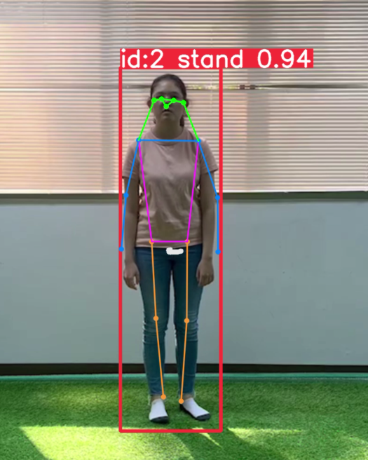
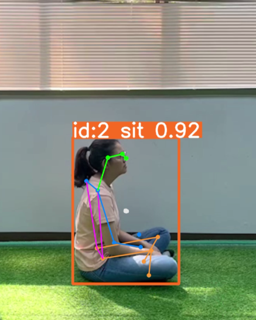
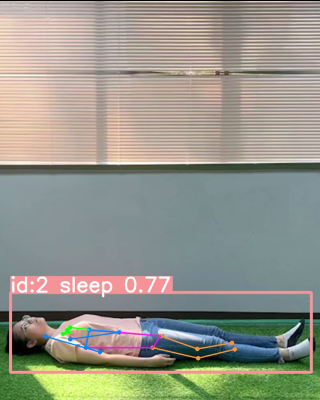

# Elderly Activity Monitoring System
This project is a activity detection and tracking system for the elderly, employing a custom trained computer vision model and transition algorithm. It utilizes web camera footage processed by Ultralytics YOLOv8 for object detection and tracking. The system trains a custom model using pose estimation for activity recognition, with results stored in a Firebase database, accessible via a Flutter web app developed in Flutterflow.

## Features
- **Activity Recognition**: Detects activities such as standing, sitting, and sleeping.
- **Transition Tracking**: Monitors transitions between activities.
- **Custom-Trained Model**: Utilizes a custom-trained computer vision model for accurate activity recognition (activity-model.pt)
- **Dataset Annotation**: Includes a program to annotate datasets according to YOLOv8 pose estimation dataset configuration (ex. activity-dataset.zip).
- **Pose Estimation**: Simple program that uses pose estimation on images and videos.
- **Web Camera Check**: Simple web camera check program.

## Activity Detection Examples

<div style="display: flex; justify-content: space-evenly;">

  <div style="text-align: center;">
    
    <p><strong>Standing Detection</strong></p>
  </div>

  <div style="text-align: center;">
    
    <p><strong>Sitting Detection</strong></p>
  </div>

  <div style="text-align: center;">
    
    <p><strong>Sleeping Detection</strong></p>
  </div>

</div>

## Prerequisites

Make sure you have the following installed:

- Python 3.7 or higher
- [pip](https://pip.pypa.io/en/stable/installation/)
- [Firebase project](https://firebase.google.com/)

## Installation

1. **Clone the repository:**

   ```bash
   git clone https://github.com/repo-name.git
   cd your-repo-name
   ```

2. **Install dependencies:**

   ```bash
   pip install opencv-python firebase-admin python-dotenv numpy ultralytics
   ```

3. **Set up your environment variables:**

   Create a `.env` file in the project root directory with the following content:

   ```env
   ELDERLY_KEY=path/to/your/firebase/serviceAccountKey.json
   DOC_ID=your_document_id
   ```

## Usage

1. **Run the program:**

   Execute the script using Python:

   ```bash
   python file-name.py
   ```

2. **Controls:**

   - The program will start your webcam and begin detecting and tracking activities.
   - The program pushes activity logs to the Firestore database every 10 seconds (can edit by changing **frequency** variable).
   - Press `q` to quit the program.

## Notes

- Ensure that your webcam is properly connected and functional.
- The YOLO model  (`activity-model.pt`) may need fine-tuning for different environments or scenarios.

## Dependencies

- `opencv-python`
- `firebase-admin`
- `python-dotenv`
- `screeninfo`
- `numpy`
- `ultralytics`

## Troubleshooting

- If you encounter issues with Firebase initialization, ensure the `ELDERLY_KEY` path and `DOC_ID` in the `.env` file are correct.
- For video capture issues, confirm that your webcam is accessible and not being used by other applications.

## License

This project is licensed under the MIT License. See the `LICENSE` file for more details.

  
